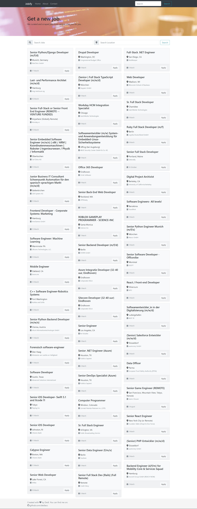

## Job Search

A simple web app to search for jobs in various websites. User can input job title and the location they want. The web app is built using `react`. As of now, the app supports getting jobs from:
- github.com
- jooble.org

I plan to add more sites and add a filter so user can checklist which sites they want to get the jobs from.

## Preview

## Usage
simply run `npm start`